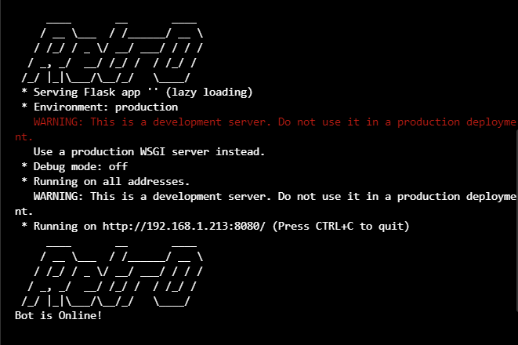
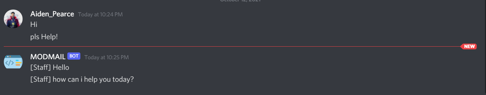

### Mod-Mail Bot

 The last Discord Bot for **Mod-Mail** you'll ever need

## 📸 Screenshots

[**Latest Version**](https://github.com/Retr0680/Mod-Mail-Bot/releases)

## Installation ⚙️
1. Fork/Clone/Download this repo

    `git clone https://github.com/Retr0680/Mod-Mail-Bot.git`

2. Navigate to the directory

    `cd Mod-Mail-Bot`

3. Install these libraries before running the program
    - 📌 Discord `pip install discord` or `pip install discord.py`
    - 📌 Flask `pip install flask`

4. Run the main.py script

    * `main.py`
    * `python3 main.py`

## 💨 Run the project

   

## Updating ⬇️

To update Discord-Bot with the stable release just pull the latest commit using Git.

Download the latest version: `git pull origin main`